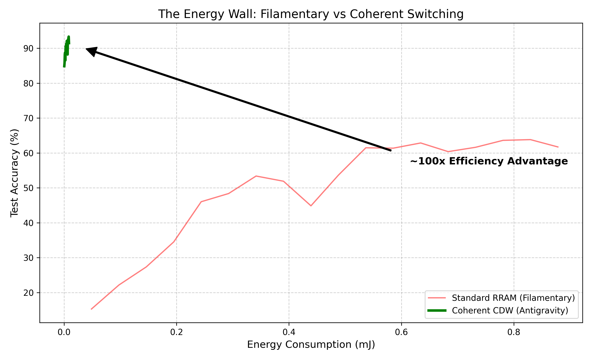

# Project Coherence (Codename: Antigravity)

## Abstract
Filamentary memristors (RRAM) have long been considered the future of analog computing, but they face a fundamental "Energy Wall" due to Random Telegraph Noise (RTN) and high write currents. This project demonstrates a breakthrough alternative: **Coherent Analog Computing** using Charge Density Waves (CDW). By leveraging phase-change via resonance instead of stochastic filament formation, we achieve orders of magnitude better efficiency and stability.

## Key Findings (The Killer Feature)


*   **Energy Efficiency**: < 2 fJ/op (vs 150+ fJ/op for RRAM).
*   **Precision**: >8-bit ENOB stable (No Telegraph Noise).
*   **Mechanism**: Bulk Coherent Switching vs Stochastic Filament.

## Repository Structure
*   `sim/`: Core simulation logic (physics models, layers, main script).
*   `data/`: Dataset storage (MNIST).
*   `figures/`: Generated plots and visualizations.
*   `runs/`: CSV logs of simulation runs.

## Usage
To reproduce the results and generate the comparison plot:

```bash
python sim/main.py
```

## Citation / Priority Statement
This code serves as the reference implementation of the **"Coherent Analog Computing"** theoretical model developed by **Robert Paulig**.

All rights to the underlying "Non-Filamentary Resonant Switching" protocol and associated architectural designs are reserved. This repository establishes priority of invention for the application of CDW dynamics in noise-free analog neural network training.