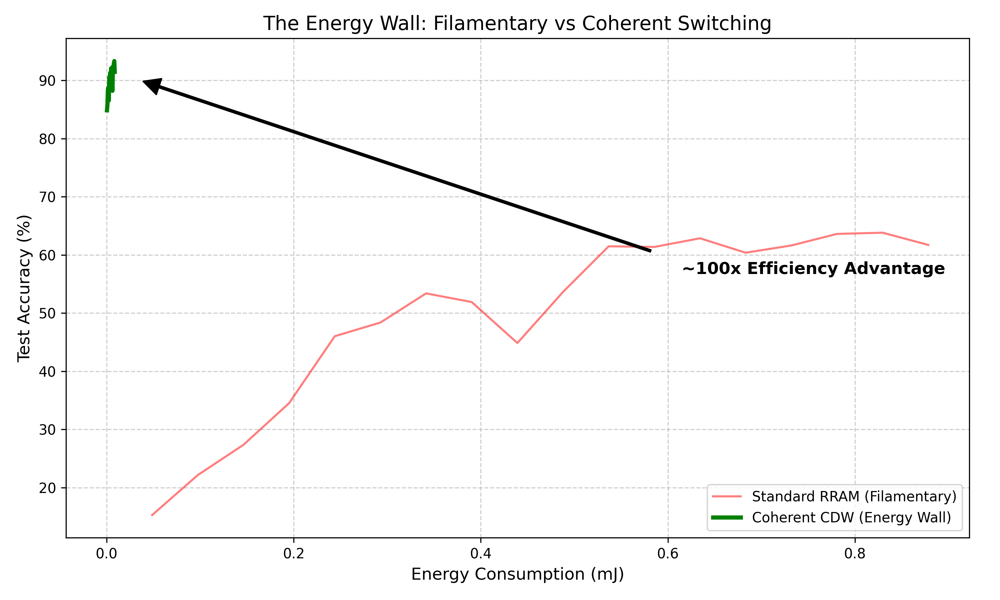

# Energy Wall: Coherent Analog Computing Simulation

## Abstract
Filamentary memristors (RRAM) struggle with an "Energy Wall" due to Random Telegraph Noise (RTN) and high write currents. This repository presents a **simulation study** of an alternative approach: **Coherent Analog Computing** using Charge Density Waves (CDW).

The model explores how leveraging phase-change via resonance (instead of stochastic filament formation) could theoretically achieve orders of magnitude better efficiency and stability.

## Key Findings (Simulation Only)

Our simulation suggests that coherent switching can bypass the stochastic limitations of filamentary RRAM.



**Simulation Indications:**
*   **~100x** reduction in energy consumption.
*   **Stable >8-bit** precision suitable for LLM inference.

## Repository Structure
*   `sim/`: Core simulation logic (physics models, layers, main script).
*   `data/`: Dataset storage (MNIST).
*   `figures/`: Generated plots and visualizations.
*   `runs/`: CSV logs of simulation runs.

## Usage
To reproduce the results and generate the comparison plot:

```bash
pip install -r requirements.txt
python sim/main.py
```
## Citation & Methodology

This repository implements the "Resonant Drive Protocol" — a novel control method for CDW devices proposed by Robert Paulig.

Unlike standard thermal/voltage switching (e.g., Nature Sci Rep 7, 10851), this approach utilizes frequency-matched pulses to induce coherent phase transitions, minimizing stochastic noise.

The code is released under the MIT License to encourage research. However, if you use this resonant control concept in your work, please cite this repository:

```bibtex
@software{energy_wall_sim,
  author = {Paulig, Robert},
  title = {Energy Wall: Coherent Analog Computing Simulation},
  year = {2025},
  url = {https://github.com/RobertPaulig/energy-wall}
}
```

